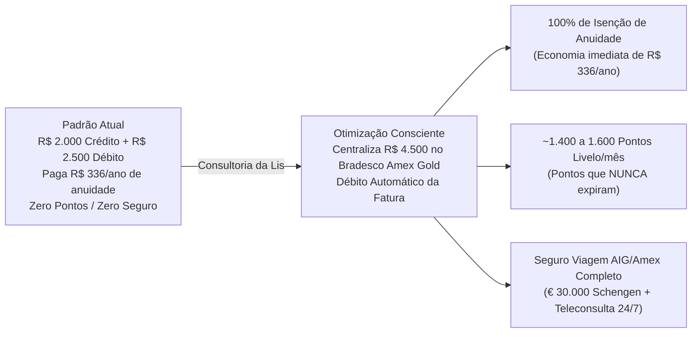

# Base de Conhecimento e Dados Mockados: Lis 💳

Esta documentação detalha a estrutura da **Base de Conhecimento** utilizada pela agente **Lis**, especialista em cartões de crédito e finanças pessoais. A base foi desenhada com dados realistas baseados no ecossistema **Banco Bradesco** e nas coberturas oficiais da apólice **AIG Seguros / American Express (Consumer)**.

---

## 1. Dados Utilizados

A base de conhecimento é composta por 4 arquivos estruturados dentro do diretório [`data/`](file:///d:/ESTUDOS/DIO/BootCamp_Bradesco/dio-lab-bia-do-futuro/data):

| Arquivo | Formato | Papel no Agente |
|---------|---------|-----------------|
| [`cartoes_credito.json`](file:///d:/ESTUDOS/DIO/BootCamp_Bradesco/dio-lab-bia-do-futuro/data/cartoes_credito.json) | JSON | Catálogo oficial de cartões com escalonamento de benefícios, rendas mínimas, faixas de isenção e apólices AIG/Amex. |
| [`perfil_cliente.json`](file:///d:/ESTUDOS/DIO/BootCamp_Bradesco/dio-lab-bia-do-futuro/data/perfil_cliente.json) | JSON | Perfil financeiro do cliente (renda mensal, cartão atual, patrimônio, hábitos de consumo e objetivos). |
| [`transacoes.csv`](file:///d:/ESTUDOS/DIO/BootCamp_Bradesco/dio-lab-bia-do-futuro/data/transacoes.csv) | CSV | Histórico detalhado de despesas do cliente, segregado por método de pagamento (`credito` vs `debito`) e categoria. |
| [`historico_atendimento.csv`](file:///d:/ESTUDOS/DIO/BootCamp_Bradesco/dio-lab-bia-do-futuro/data/historico_atendimento.csv) | CSV | Histórico de atendimentos prévios (dúvidas de tarifas de anuidade, seguros de viagem e limites). |

---

## 2. Escalonamento de Cartões de Crédito

Os cartões foram organizados em um escalonamento progressivo de categorias, desenhado para atender desde quem busca custo zero até quem deseja proteções globais de viagem da apólice **AIG Seguros / Amex**:

| Cartão | Categoria | Renda Mínima | Anuidade | Regra de Isenção (100%) | Programa de Benefícios | Destaques de Seguros e Assistências (AIG / Amex) |
|--------|-----------|--------------|----------|-------------------------|------------------------|--------------------------------------------------|
| **Bradesco Neo Visa** | Entrada | R$ 1.500 | 12x R$ 30 | Gasto mensal $\ge$ R$ 50 | Vai de Visa + 50% Cinemark | Proteção de Compra básica |
| **Bradesco Like Visa** | Intermediário (Cashback) | R$ 4.000 | 12x R$ 43 | Gasto mensal $\ge$ R$ 3.000 (ou R$ 30k investidos) | Até 3% de cashback direto na fatura | Proteção de Preço, Compra e Garantia Estendida |
| **Bradesco Amex Gold Card** | Intermediário-Avançado (Pontos & Viagem) | R$ 8.000 | 12x R$ 54 | Gasto mensal $\ge$ R$ 4.000 (ou R$ 50k investidos) | 1.5 a 1.8 pts/US$ (Livelo/Membership nunca expiram) | Despesas Médicas US$ 25k (€ 30k Schengen), Bagagem US$ 2k, Acompanhante US$ 3k, Veículo Alugado CRLDI, Teleconsulta 24/7 |
| **Bradesco The Platinum Card® (TPC)** | Alta Renda (Prestige) | R$ 20.000 | 12x R$ 135 | Gasto mensal $\ge$ R$ 10.000 (ou R$ 100k investidos) | 2.2 a 3.0 pts/US$ vitalícios | Despesas Médicas US$ 30k, Morte/Invalidez US$ 500k, Salas VIP Centurion/Bradesco Lounges, Concierge 24/7, Garantia Estendida até US$ 25k/ano |
| **The Centurion® Card** | Ultra High Net Worth | R$ 100.000+ (Private) | 12x R$ 2.083 | Negociação exclusiva Private Bank | 5.0 a 7.0 pts/US$ | Despesas Médicas US$ 150k (90 dias), Invalidez/Morte US$ 1.5M, Retorno em Executiva até US$ 3k, Veículo até US$ 75k |

> [!NOTE]
> **Base Regulamentar das Coberturas:** Os valores de capitais segurados, despesas médicas hospitalares (DMH), repatriação médica, seguro de bagagem, atraso de voo e serviço de Teleconsulta Global Virtual 24/7 foram modelados em conformidade com as Condições Gerais da **AIG Seguros Brasil S.A.** para portadores de cartões American Express emitidos pelo Banco Bradesco.

---

## 3. Perfil do Cliente e Oportunidade Consultiva

### Dados do Cliente Exemplo: Adenilton Pelaes
- **Idade:** 34 anos | **Profissão:** Engenheiro de Software Sênior
- **Renda Mensal:** R$ 8.000,00
- **Patrimônio / Reserva:** R$ 25.000,00 (em CDB liquidez diária)
- **Cartão Atual:** *Bradesco Classic Internacional*
  - Anuidade paga: R$ 28,00/mês (R$ 336,00/ano)
  - Benefícios: **Zero** (não pontua na Livelo nem devolve cashback, sem seguro de viagem)

### Comportamento Real de Gastos (Extrato Consolidado: R$ 4.500,00)
- **Gastos atuais no Cartão de Crédito:** **R$ 2.000,00** (compras online, lazer, delivery, vestuário)
- **Gastos atuais no Cartão de Débito:** **R$ 2.500,00** (supermercados: R$ 1.700, combustíveis: R$ 500, farmácia: R$ 190, padaria: R$ 110)

### Oportunidade Identificada pela Lis:


> [!IMPORTANT]
> **Diretriz de Crédito Consciente:** A Lis orienta o cliente a transferir compras rotineiras essenciais do débito para o crédito **sem aumentar o volume total de despesas** e mantendo o valor correspondente guardado na conta corrente ou reserva com liquidez para quitação integral da fatura no vencimento.

---

## 4. Estratégia de Integração e RAG

A arquitetura do agente integra os dados em três etapas:

1. **Pré-Processamento e Agregação Financeira:**
   - O orquestrador Python lê `transacoes.csv` e totaliza os gastos do cliente por método de pagamento e categoria.
   - Identifica despesas no débito que possuem alto potencial de cashback/pontos.
2. **Filtragem Regrada de Elegibilidade:**
   - Compara a renda do cliente (`R$ 8.000,00`) com a `renda_minima` do catálogo de cartões.
   - Avalia a viabilidade da política de isenção: como o gasto potencial consolidado é de **R$ 4.500,00**, o cliente cumpre os critérios para isenção total (100%) tanto do **Bradesco Like Visa** (requer R$ 3.000) quanto do **Bradesco American Express® Gold Card** (requer R$ 4.000).
3. **Injeção Dinâmica no Prompt do Modelo:**
   - O prompt do sistema recebe a persona da Lis e as diretrizes anti-alucinação.
   - O prompt do usuário é enriquecido com um bloco estruturado contendo o perfil consolidado do cliente, seu extrato sumarizado e as opções de cartões elegíveis.

---

## 5. Exemplo de Contexto Montado para o Modelo

Abaixo, o formato do payload injetado pelo orquestrador no momento da consulta:

```markdown
=== CONTEXTO DO CLIENTE ===
Nome: Adenilton Pelaes | Idade: 34 anos | Profissão: Engenheiro de Software Sênior
Renda Mensal Comprovada: R$ 8.000,00 | Reserva de Emergência: R$ 25.000,00
Cartão Atual: Bradesco Classic Internacional (Anuidade: R$ 28,00/mês | Pontos: 0 | Seguros: Inexistentes)

=== RESUMO DO COMPORTAMENTO FINANCEIRO (ÚLTIMO MÊS) ===
- Gasto Total Mensal: R$ 4.500,00
  * No Crédito: R$ 2.000,00 (Compras online, streaming, lazer, vestuário)
  * No Débito: R$ 2.500,00 (Supermercado: R$ 1.700 | Combustível: R$ 500 | Farmácia: R$ 190 | Padaria: R$ 110)
- Comportamento de Pagamento: Paga faturas sempre em dia, não utiliza crédito rotativo.

=== PRODUTOS ELEGÍVEIS DA BASE DE CONHECIMENTO ===
Opção 1: Bradesco American Express® Gold Card
- Renda Mínima: R$ 8.000,00 (Cliente Elegível)
- Anuidade: R$ 648,00 (12x R$ 54,00)
- Política de Isenção: 100% de isenção com gastos a partir de R$ 4.000,00/mês (Atingível com gastos de R$ 4.500)
- Pontos: 1.5 a 1.8 pts/US$ na Livelo/Membership Rewards (Nunca expiram)
- Seguros AIG Amex: Cobertura médica internacional US$ 25.000 (€ 30.000 Schengen), extravio bagagem US$ 2.000, acompanhante hospitalar, seguro aluguel de veículos CRLDI, Teleconsulta Global 24/7 gratuita.

Opção 2: Bradesco Like Visa
- Renda Mínima: R$ 4.000,00 (Cliente Elegível)
- Anuidade: R$ 516,00 (12x R$ 43,00)
- Política de Isenção: 100% de isenção com gastos a partir de R$ 3.000,00/mês
- Recompensas: Até 3% de cashback direto na fatura no segmento de escolha
- Proteções: Proteção de Preço, Compra e Garantia Estendida

=== DIRETRIZES DA RESPOSTA ===
1. Mostre ao cliente a economia de cancelar a anuidade inútil de R$ 336/ano do cartão Classic.
2. Demonstre que ao migrar os R$ 2.500 de débito para o crédito (somando R$ 4.500), ele alcança 100% de isenção no Amex Gold Card ou no Like Visa.
3. Se o foco for viagens, destaque a proteção médica Schengen (€ 30.000) e os pontos vitalícios da Livelo/Amex.
4. Reforce o consumo consciente: manter o dinheiro em conta para pagar a fatura integralmente em débito automático.
```
